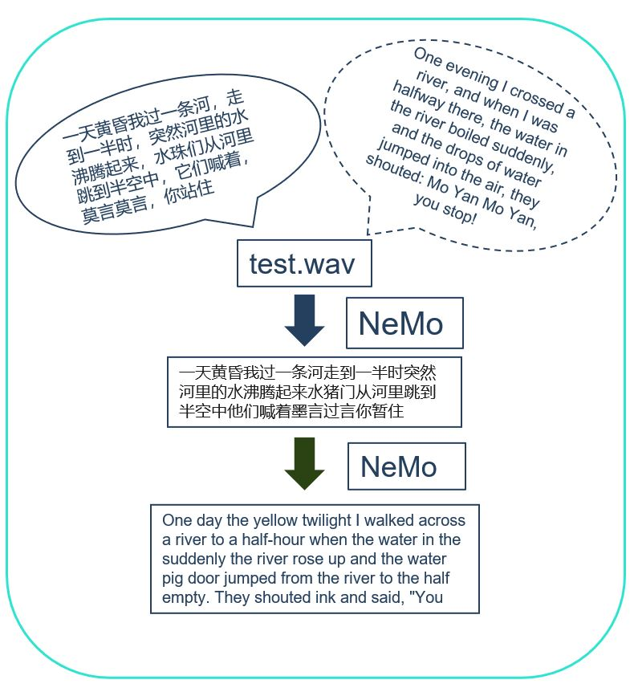

## NeMo Example
### Introduction:
This demo is used to recogize Chinese language in (WAV) audio file to plan text, and translate it into English.

* [How NeMo used CUDA-X and GPU?](https://github.com/charleshardy/GPU-WRLinux/blob/main/3_Software/4_Toolkit_SDK/CUDA-X/README.md#how-does-nemo-toolkit-invoke-cuda-and-gpu)

### Run NeMo Demo
```
# python nemo_demo.py or python3 nemo_demo.py
[NeMo W 2021-06-09 09:21:20 patch_utils:49] torch.stft() signature has been updated for PyTorch 1.7+
    Please update PyTorch to remain compatible with later versions of NeMo.
Transcribing: 100%|█████████| 1/1 [00:00<00:00,  1.94it/s]
['一天黄昏我过一条河走到一半时突然河里的水沸腾起来水猪门从河里跳到半空中他们喊着墨言过言你暂住']
[NeMo I 2021-06-09 09:21:20 cloud:56] Found existing object /mnt/sdb/xhou/HOME/.cache/torch/NeMo/NeMo_1.0.1/nmt_zh_en_transformer6x6/eff3792e6f4420ba83436be889e92d79/nmt_zh_en_transformer6x6.nemo.
[NeMo I 2021-06-09 09:21:20 cloud:62] Re-using file from: /mnt/sdb/xhou/HOME/.cache/torch/NeMo/NeMo_1.0.1/nmt_zh_en_transformer6x6/eff3792e6f4420ba83436be889e92d79/nmt_zh_en_transformer6x6.nemo
[NeMo I 2021-06-09 09:21:20 common:675] Instantiating model from pre-trained checkpoint
[NeMo I 2021-06-09 09:21:30 tokenizer_utils:129] Getting YouTokenToMeTokenizer with model: /tmp/tmp_zkz0zea/tokenizer.decoder.32000.BPE.model.
[NeMo I 2021-06-09 09:21:30 tokenizer_utils:129] Getting YouTokenToMeTokenizer with model: /tmp/tmp_zkz0zea/tokenizer.encoder.32000.BPE.model.
[NeMo W 2021-06-09 09:21:30 modelPT:137] If you intend to do training or fine-tuning, please call the ModelPT.setup_training_data() method and provide a valid configuration file to setup the train data loader.
    Train config : 
    src_file_name: /raid/tarred_data_accaligned_16k_tokens_32k_vocab_cov_0.999/batches.tokens.16000._OP_1..144_CL_.tar
    tgt_file_name: /raid/tarred_data_accaligned_16k_tokens_32k_vocab_cov_0.999/batches.tokens.16000._OP_1..144_CL_.tar
    tokens_in_batch: 16000
    clean: true
    max_seq_length: 512
    cache_ids: false
    cache_data_per_node: false
    use_cache: false
    shuffle: true
    num_samples: -1
    drop_last: false
    pin_memory: false
    num_workers: 8
    load_from_cached_dataset: false
    reverse_lang_direction: true
    load_from_tarred_dataset: true
    metadata_path: /raid/tarred_data_accaligned_16k_tokens_32k_vocab_cov_0.999/metadata.json
    tar_shuffle_n: 100
    
[NeMo W 2021-06-09 09:21:30 modelPT:1198] World size can only be set by PyTorch Lightning Trainer.
[NeMo I 2021-06-09 09:21:34 modelPT:434] Model MTEncDecModel was successfully restored from /mnt/sdb/xhou/HOME/.cache/torch/NeMo/NeMo_1.0.1/nmt_zh_en_transformer6x6/eff3792e6f4420ba83436be889e92d79/nmt_zh_en_transformer6x6.nemo.
['One day the yellow twilight I walked across a river to a half-hour when the water in the suddenly the river rose up and the water pig door jumped from the river to the half empty. They shouted ink and said, "You']
```

#### Notes
The original Chinese text of the WAV audio were as below.
```
一天黄昏我过一条河，走到一半时，突然河里的水沸腾起来，水珠们从河里跳到半空中，它们喊着，莫言莫言，你站住
```
The WAVE audio file
* https://github.com/charleshardy/GPU-WRLinux/blob/main/3_Software/5_Applications/CUDA-X/NeMo/test.wav

The original English translation
```
One evening I crossed a river, and when I was halfway there, the water in the river boiled suddenly, and the drops of water jumped into the air, they shouted: Mo Yan Mo Yan, you stop!
```
##### Process



### More About NeMo Demo
#### Technical Background

A typical conversational AI application uses three subsystems to do the steps of processing and transcribing the audio, understanding (deriving meaning) of the question asked, generating the response (text) and speaking the response back to the human. These steps are achieved by multiple deep learning solutions working together. First, automatic speech recognition (ASR) is used to process the raw audio signal and transcribing text from it. Second, natural language processing (NLP) is used to derive meaning from the transcribed text (ASR output). Last, speech synthesis or text-to-speech (TTS) is used for the artificial production of human speech from text. Optimizing this multi-step process is complicated, as each of these steps requires building and using one or more deep learning models. When developing a deep learning model to achieve the highest performance and accuracy for each of these areas, a developer will encounter several approaches and experiments that can vary by domain application.


Below is the code snippet of Audio Translator application that uses three subsystems to do the steps of processing and transcribing the audio.
```python
# Import NeMo and it's ASR, NLP and TTS collections
import nemo
# Import Speech Recognition collection
import nemo.collections.asr as nemo_asr
# Import Natural Language Processing colleciton
import nemo.collections.nlp as nemo_nlp
# Import Speech Synthesis collection
import nemo.collections.tts as nemo_tts

# Next, we instantiate all the necessary models directly from NVIDIA NGC
# Speech Recognition model - QuartzNet trained on Russian part of MCV 6.0
quartznet = nemo_asr.models.EncDecCTCModel.from_pretrained(model_name="stt_ru_quartznet15x5").cuda()
# Neural Machine Translation model
nmt_model = nemo_nlp.models.MTEncDecModel.from_pretrained(model_name='nmt_ru_en_transformer6x6').cuda()
# Spectrogram generator which takes text as an input and produces spectrogram
spectrogram_generator = nemo_tts.models.Tacotron2Model.from_pretrained(model_name="tts_en_tacotron2").cuda()
# Vocoder model which takes spectrogram and produces actual audio
vocoder = nemo_tts.models.WaveGlowModel.from_pretrained(model_name="tts_waveglow_88m").cuda()
# Transcribe an audio file
# IMPORTANT: The audio must be mono with 16Khz sampling rate
# Get example from: https://nemo-public.s3.us-east-2.amazonaws.com/mcv-samples-ru/common_voice_ru_19034087.wav
russian_text = quartznet.transcribe(['Path_to_audio_file'])
print(russian_text)
# You should see russian text here. Let's translate it to English
english_text = nmt_model.translate(russian_text)
print(english_text)
# After this you should see English translation
# Let's convert it into audio
# A helper function which combines Tacotron2 and WaveGlow to go directly from
# text to audio
def text_to_audio(text):
  parsed = spectrogram_generator.parse(text)
  spectrogram = spectrogram_generator.generate_spectrogram(tokens=parsed)
  audio = vocoder.convert_spectrogram_to_audio(spec=spectrogram)
  return audio.to('cpu').numpy()
audio = text_to_audio(english_text[0])
```
As a result, a CTC (Connectionist Temporal Classification) based ASR pipeline consists of the following blocks, shown below:

```
Feature extraction: Audio signal preprocessing using normalization, windowing, (log) spectrogram 
(or mel scale spectrogram, or MFCC).
```
```
Acoustic Model: A CTC-based network that predicts the probability distributions P_t(c) over vocabulary characters c 
per each time step t. For this block we use NVIDIA’s high performing acoustic models: Jasper and QuartzNet.
```
```
Decoding/Decoder:

    Greedy (argmax): Is the simplest strategy for a decoder. The letter with the highest probability
    (temporal softmax output layer) is chosen at each time-step, without regard to any semantic 
    understanding of what was being communicated. Then, the repeated characters are removed or 
    collapsed, and blank tokens are discarded.
    A language model can be used to add contex,t and therefore correct mistakes in the acoustic model.  
    A beam search decoder weights the relative probabilities the softmax output against the likelihood 
    of certain words appearing in context and tries to determine what was spoken by combining both what 
    the acoustic model thinks it heard with what is a likely next word
```
To facilitate the implementation and domain adaptation of the complete ASR pipeline, we created the Domain Specific – NeMo ASR Application. This application is developed using NeMo and it enables you to train or fine-tune pre-trained (acoustic and language) ASR models with your own data. Through this application, we empower you to train, evaluate and compare ASR models built on your own domain specific audio data. This gives you the ability to progressively create better performing ASR models specifically built for your data.

#### Citrinet (Model 1)
Citrinet is a version of QuartzNet [ASR-MODELS4] that extends ContextNet [ASR-MODELS2], utilizing subword encoding (via Word Piece tokenization) and Squeeze-and-Excitation mechanism [ASR-MODELS3] to obtain highly accurate audio transcripts while utilizing a non-autoregressive CTC based decoding scheme for efficient inference.


And you can find detail descriptions on https://ngc.nvidia.com/catalog/models/nvidia:nemo:stt_zh_citrinet_512.

#### Machine translation (Model 2)

Machine translation is the task of translating text from one language to another. For example, from English to Spanish. Models are based on the Transformer sequence-to-sequence architecture [nlp-machine_translation4].

You can refer to follow codes to translate English to Spanish:
```python
from nemo.collections.nlp.models import MTEncDecModel

# To get the list of pre-trained models
MTEncDecModel.list_available_models()

# Download and load the a pre-trained to translate from English to Spanish
model = MTEncDecModel.from_pretrained("nmt_en_es_transformer12x2")

# Translate a sentence or list of sentences
translations = model.translate(["Hello!"], source_lang="en", target_lang="es")
```
In the nemo demo, we translate Chinese into English, for more details you can refer to:
https://ngc.nvidia.com/catalog/models/nvidia:nemo:nmt_zh_en_transformer6x6

### Issues
* Cannot display Chinese charactors from the terminal
#### Solution
Set Encoding on the terminal to Unicode UTF-8

### References
* https://docs.nvidia.com/deeplearning/nemo/user-guide/docs/en/main/


### Demo Video:
> None
