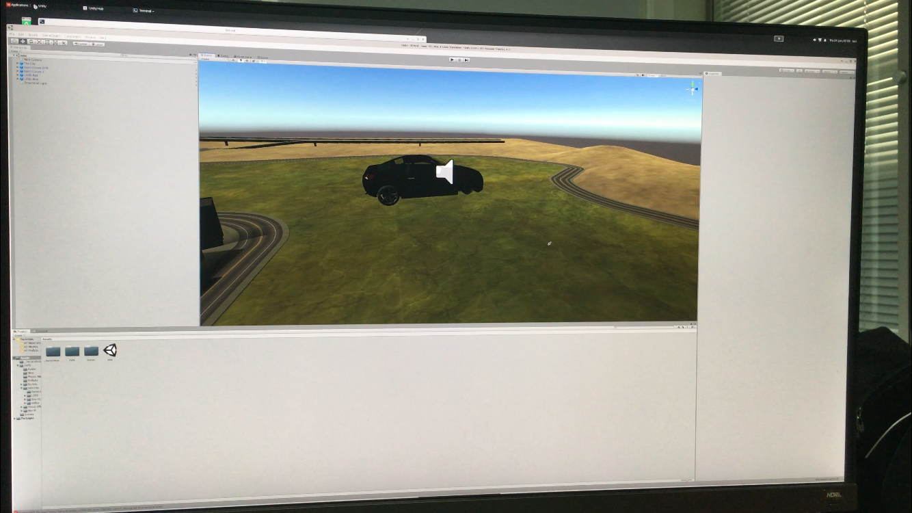

## Making My First Game on Unity 3D Engine
This demo shows the scene of Vehicle Physics 5.2, which is running on Wind River Linux

### Unity Setup Steps

* [Setup Steps](https://github.com/windriver-codecamp/GPU-WRLinux/tree/main/3_Software/4_Toolkit_SDK/Unity)

### Start Unity 3D Engine and create my first game

```
Editor# ./Unity
```

```
1. Select "3D-test" in the pop up window
2. Select "unity"  on the Unity version (e.g. 2019.2.61f) 
3. Click "3D-test" project
4. After the importing of the project, the Vehicle will show

```



## References
* https://docs.unity3d.com/Manual/UnityManual.html
* https://home.aigei.com:8443/0-r12/GeiFileLocalStore/b80/pkg/code/zip/cf/cf17a9fda1b2435f95b379fcb789bfd0.zip?download/unity%E6%B1%BD%E8%BD%A6%E4%BB%BF%E7%9C%9F%E6%A8%A1%E6%8B%9FEdys+Vehicle+Physic_%E7%88%B1%E7%BB%99%E7%BD%91_aigei_com.zip&e=1624541760&token=P7S2Xpzfz11vAkASLTkfHN7Fw-oOZBecqeJaxypL:6gBopyAaXhrpDbJuzvvmGWhY6cc=
