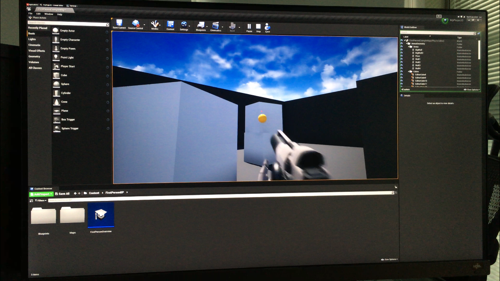

## Making My First Game on Unreal Engine
This demo shows to create the first game on UE4, which is running on Wind River Linux

### Unreal Engine Installation

* [Setup Steps](https://github.com/windriver-codecamp/GPU-WRLinux/blob/main/3_Software/4_Toolkit_SDK/UnrealEngine/README.md)

### Start Unreal Engine and create my first game

```
UnrealEngine-release/Engine/Binaries/Linux# ./UE4Editor
```

```
1. Select "Game" in the pop up window then click "Next" button
2. Select "First Person" then click "Next" button
3. Click "Create Project" button
4. After the creation of the project, run "Build"
5. Click "Play" button and enjoy

```



## References
* https://docs.unrealengine.com/4.26/en-US/Basics/GettingStarted/

## Demo Video:
> None

