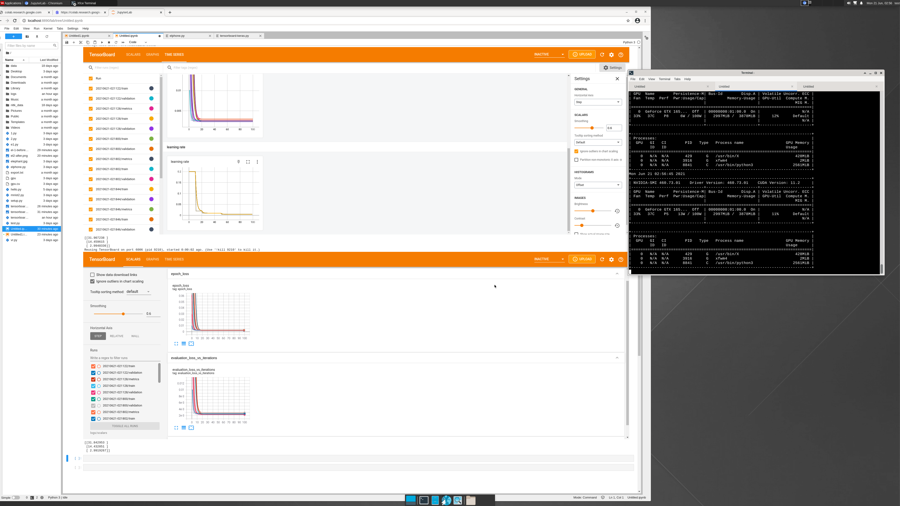
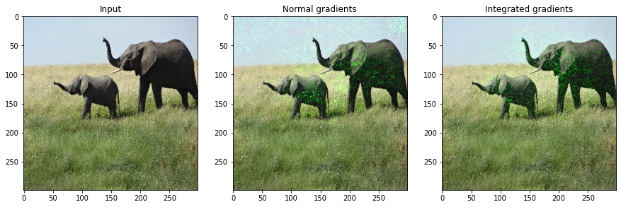

## TensorFlow Example 1

### Introduction

This demo use Keras to calculate a regression, i.e., find the best line of fit for a paired data set.
(While using neural networks and gradient descent is overkill for this kind of problem, it does make for a very easy to understand example.)

TensorBoard is used to observe how training and test loss change across epochs. The training and test loss decrease over time and then remain steady.

First, generate 1000 data points roughly along the line y = 0.5x + 2. Split these data points into training and test sets. The neural net learns this relationship.

### Run example 1
```
# /home/test/.local/bin/jupyter-lab training.py
```
### Result
#### Before

#### After

### Issues
### References
  * https://www.tensorflow.org/tensorboard/scalars_and_keras

## TensorFlow Example 2
### Introduction
This demo is applying the integrated gradients technique on image object recognition. 

The object recognition network is trained and built using GoogleNet architecture (Szegedy
et al., 2014) and ImageNet object recognition dataset (Russakovsky et al., 2015). 

The integrated gradients method to study pixel importance in predictions made by this network. 
The gradients are computed for the output of the highest-scoring class with respect to pixel of the input image. 
The baseline input is the black image, i.e., all pixel intensities are zero.

### Run example 2
```
# /home/test/.local/bin/jupyter-lab keras-elephone.py 
```
### Results


### Issues
## References
* https://keras.io/examples/vision/integrated_gradients/
* https://arxiv.org/pdf/1703.01365.pdf


