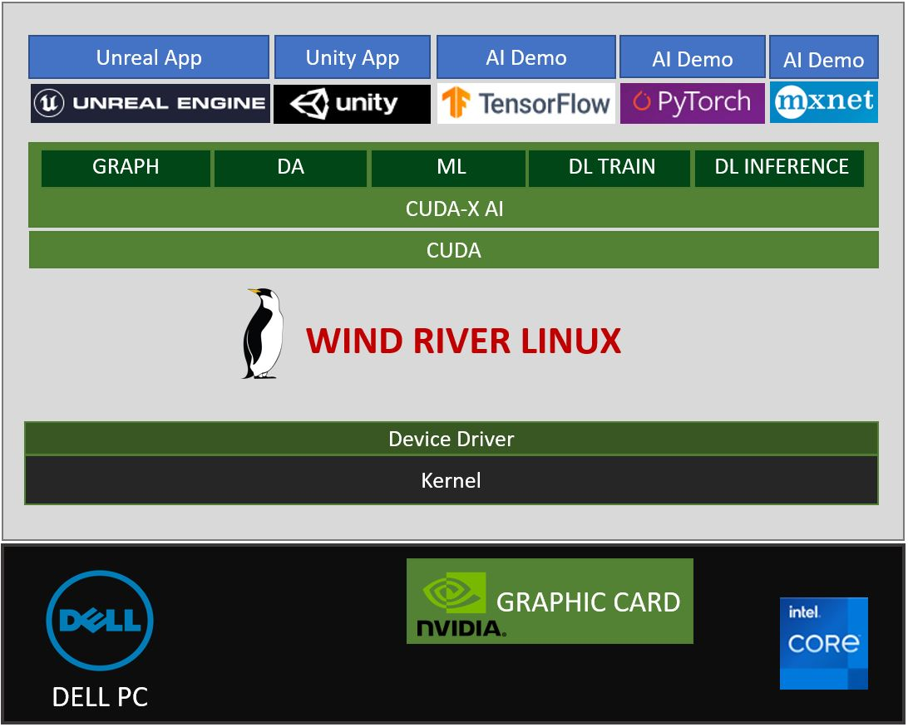
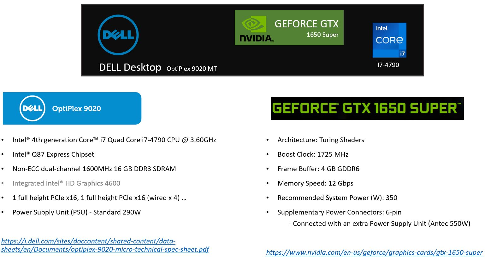
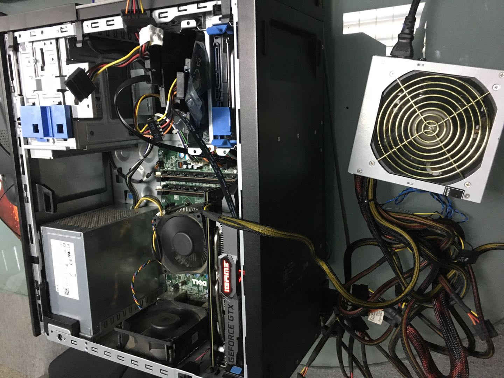
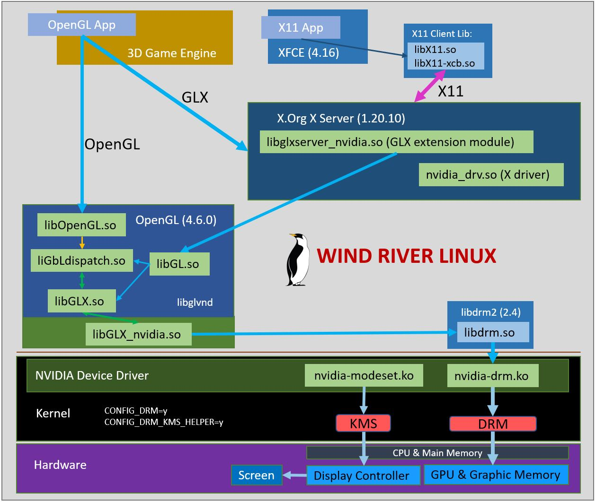
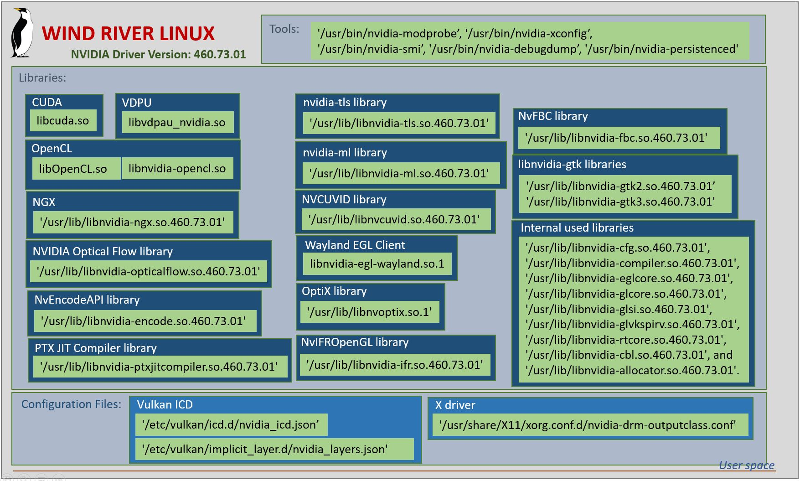

# GPU-WRLinux
Exploring NVIDIA GPU-Accelerated Ecosystem on Wind River Linux

## Overview

## Hardware

## Software
### Wind River Linux Kernel and Device Driver

### X Windows and OpenGL

### NVIDIA Driver Userspace

### Kernel and Device Drivers
		Overview Picture:
		Setup Steps:
		Issues:
		Solution:
		References:
### X Windows Desktop (XFCE)
		Setup Steps:
		Issues:
		Solution:
		References:
### Toolkit and SDK (CUDA, CUDA-X, Game Engines, etc.)
#### CUDA
			Setup Steps:
			Issues:
			Solution:
			References:
#### CUDA-X
			Setup Steps:
			Issues:
			Solution:
			References:
#### Unreal Engine
			Setup Steps:
			Issues:
			Solution:
			References:
#### Unity
	Setup Steps:
	1. register an account on unity
	https://id.unity.com/en/conversations/aec46371-1052-4108-afdf-c7f8312edfb2018f?view=register

	2. Download Unity Editor

	http://beta.unity3d.com/download/fe82a0e88406/LinuxEditorInstaller/Unity.tar.xz
	tar xf Unity.tar.xz

	3. Download Unity Hub
	https://public-cdn.cloud.unity3d.com/hub/prod/UnityHub.AppImage?_gl=1*8s7rkd*_ga*OTMwMjEzMTk4LjE2MjIwODY0ODc.*_ga_1S78EFL1W5*MTYyMjUzODA2MC42LjEuMTYyMjUzODM5NS4w&_ga=2.51340841.1006021791.1622517514-930213198.1622086487

	4. Run Unity Hub and login
	./UnityHub.AppImage

	5. Active new license
	License Management --> Active new license

	6. Install Unity Editor
	Installs --> Locate, select Unity Editor (tar the Unity.tar.xz)

	7. Run projects
	Projects --> New --> 3D --> create  

	Issues: Failed to login with company website.
	Solution: Use WIFI from telphone.
	References: https://blog.csdn.net/qq_30448401/article/details/104576125

#### Video Codec SDK (TODO)
			Setup Steps:
			Issues:
			Solution:
			References:
#### TensorFlow
			Setup Steps:
			Issues:
			Solution:
			References:
#### PyTorch
	Setup Steps:
		1. Installing Anaconda3
			$ mkdir /mnt/sdb/xhou/HOME
			$ export HOME=/mnt/sdb/xhou/HOME
			$ wget --no-check-certificate https://repo.anaconda.com/archive/Anaconda3-2021.05-Linux-x86_64.sh
			$ bash Anaconda3-2021.05-Linux-x86_64.sh
			$ source ~/.bashrc
		2. Building&Installting PyTorch
			$ conda create --name pytorch-build
			$ conda activate pytorch-build
			(pytorch-build) $ conda install astunparse numpy ninja pyyaml mkl mkl-include setuptools cmake cffi typing_extensions future six requests dataclasses
			(pytorch-build) $ conda install -c pytorch magma-cuda112
			(pytorch-build) $ git clone --recursive https://github.com/pytorch/pytorch
			(pytorch-build) $ cd pytorch
			(pytorch-build) $ git submodule sync
			(pytorch-build) $ git submodule update --init --recursive
			(pytorch-build) $ cat ~/cuda.env
			export LD_LIBRARY_PATH=$LD_LIBRARY_PATH:/usr/local/cuda/lib64
			export PATH=$PATH:/usr/local/cuda/bin
			export CUDA_HOME="/usr/local/cuda"
			export CUDA_NVCC_EXECUTABLE="/usr/local/cuda/bin/nvcc"
			export CUDNN_INCLUDE_PATH="/usr/local/cuda/include/"
			export CUDNN_LIBRARY_PATH="/usr/local/cuda/lib64/"
			(pytorch-build) $ cat ~/pytorch_build.env
			export LIBRARY_PATH="/usr/local/cuda/lib64"
			export CMAKE_PREFIX_PATH=${CONDA_PREFIX:-"$(dirname $(which conda))/../"}
			(pytorch-build) $ source ~/cuda.env
			(pytorch-build) $ source ~/pytorch_build.env
			## with CUDNN
			(pytorch-build) $ export USE_CUDA=1 USE_CUDNN=1 USE_MKLDNN=1
			## building branch master
			(pytorch-build) $ python setup.py install # about 1.5hrs

			(pytorch-build) $ python
			Python 3.9.5 (default, May 18 2021, 19:34:48)
			[GCC 7.3.0] :: Anaconda, Inc. on linux
			Type "help", "copyright", "credits" or "license" for more information.
			>>> import torch
			>>> torch.cuda.current_device()
			0
			>>> torch.cuda.get_device_name(0)
			'GeForce GTX 1650 SUPER'
			>>>
			>>> from torch.backends import cudnn
			>>> cudnn.is_available()
			True
			>>>

	Issues:
		None

	Solution:
		None

	References:
		None
#### MXNet
	Setup Steps:
		1. CUDA&cuDNN
			They are CUDA 11.2 and cuDNN 8.2, skips installing&setups here
		2. Anaconda
			Skips installing, only setups
			$ conda create --name mxnet-binary
			$ conda activate mxnet-binary
		3. NCCL
			$ wget https://developer.nvidia.com/compute/machine-learning/nccl/secure/2.8.3/agnostic/x64/nccl_2.8.3-1+cuda11.2_x86_64.txz
			$ xz -d nccl_2.8.3-1+cuda11.2_x86_64.txz
			$ tar xf nccl_2.8.3-1+cuda11.2_x86_64.txz
			# deploy to directory of CUDA
			$ cp nccl_2.8.3-1+cuda11.2_x86_64/include/nccl* /usr/local/cuda/include/
			$ cp -P nccl_2.8.3-1+cuda11.2_x86_64/lib/libnccl* /usr/local/cuda/lib64/
			$ chmod a+r /usr/local/cuda/include/nccl* /usr/local/cuda/lib64/libnccl*
		4. Installing MXNet with Binary
			# version with CUDA 11.2
			$ pip install mxnet-cu112
			# try with
			$ python
			>>> import mxnet as mx
			>>> a = mx.nd.ones((2, 3), mx.gpu())
			>>> b = a * 2 + 1
			>>> b.asnumpy()
			array([[ 3.,  3.,  3.],
				[ 3.,  3.,  3.]], dtype=float32)

	Issues:
		None

	Solution:
		None

	References:
		None
#### Transfer Learning Toolkit (TODO)
			Setup Steps:
			Issues:
			Solution:
			References:
### Applications
#### CUDA examples
			Demo Video 1:
			Demo Source Codes:
			Setup Steps:
			Issues:
			Solution:
			References:
#### CUDA-X Example (NeMo)
			Demo Video:
			Demo Source Codes:
			Setup Steps:
			Issues:
			Solution:
			References:
#### Unreal Demo (Metahuman)
			Demo Video:
			Demo Source Codes:
			Setup Steps:
			Issues:
			Solution:
			References:
#### Unity App (TODO)
			Demo Video:
			Demo Source Codes:
			Setup Steps:
			Issues:
			Solution:
			References:
#### Tensorflow (TODO)
			Demo Video:
			Demo Source Codes:
			Setup Steps:
			Issues:
			Solution:
			References:
#### PyTorch
	Demo Video:
		None

	Demo Source Codes:
		https://github.com/pytorch/examples/tree/master/word_language_model

	Setup Steps:
		(pytorch-build) $ git clone https://github.com/pytorch/examples.git
		(pytorch-build) $ cd examples/word_language_model
		(pytorch-build) $ python main.py --cuda --emsize 650 --nhid 650 --dropout 0.5 --epochs 40 --tied # 40 epoches, 141 minutes
		(pytorch-build) $ python generate.py --cuda --words 100
		| Generated 0/100 words
		(pytorch-build) $ cat generated.txt
		to the present of stabilized fountains , because they did not do so by the time they did contribute to
		the personal structure . Additionally , the rate of the entire event was often survives at projects of homes .
		<eos> The work records different as of 2009 . The front music guides erected all the style of several "
		<unk> " and " <unk> " <unk> ( proper water ) . In 2007 , Pflueger created the " More
		coded balanced " at this point and recorded a primary event played in a US 2 , which was the

	Issues:
		None

	Solution:
		None

	References:
		None
#### MXNet
	Demo Video:
		None

	Demo Source Codes:
		https://github.com/apache/incubator-mxnet/tree/master/example/gluon/super_resolution

	Setup Steps:
		1. Getting Source
			$ git clone --recursive https://github.com/apache/incubator-mxnet.git mxnet
			$ cd mxnet/example/gluon/super_resolution
			## have an update
			$ cat 0001-Update-super_resolution.py.patch
			From f4305b7944ab61a5b9a18a8bd627578279d9442f Mon Sep 17 00:00:00 2001
			From: test <test@test.com>
			Date: Sun, 6 Jun 2021 11:35:39 +0000
			Subject: [PATCH] Update super_resolution.py
			
			---
			example/gluon/super_resolution/super_resolution.py | 2 +-
			1 file changed, 1 insertion(+), 1 deletion(-)
			
			diff --git a/example/gluon/super_resolution/super_resolution.py b/example/gluon/super_resolution/super_resolution.py
			index 52bfc2241..4a3e8d92a 100644
			--- a/example/gluon/super_resolution/super_resolution.py
			+++ b/example/gluon/super_resolution/super_resolution.py
			@@ -156,7 +156,7 @@ class SuperResolutionNet(gluon.HybridBlock):
					return x
			
			net = SuperResolutionNet(upscale_factor)
			-metric = mx.gluon.metric.MSE()
			+metric = mx.metric.MSE()
			
			def test(ctx):
				val_data.reset()
			--
			2.31.1
			
			$ git am 0001-Update-super_resolution.py.patch
		2. Training and Trying
			## Training
			$ time python super_resolution.py --epochs 200 --use-gpu
			Namespace(upscale_factor=3, batch_size=4, test_batch_size=100, epochs=200, lr=0.001, use_gpu=True, seed=123, resolve_img=None)
			Directory /mnt/sdb/xhou/HOME/.mxnet/datasets/BSDS500 already exists, skipping.
			To force download and extraction, delete the directory and re-run.
			[08:32:10] ../src/base.cc:80: cuDNN lib mismatch: linked-against version 8200 != compiled-against version 8100.  Set MXNET_CUDNN_LIB_CHECKING=0 to quiet this warning.
			[08:32:12] ../src/operator/nn/./cudnn/./cudnn_algoreg-inl.h:97: Running performance tests to find the best convolution algorithm, this can take a while... (set the environment variable MXNET_CUDNN_AUTOTUNE_DEFAULT to 0 to disable)
			training mse at epoch 0: mse=0.020209
			validation avg psnr: 20.432425
			......
			training mse at epoch 199: mse=0.004085
			validation avg psnr: 23.290054
			
			real    6m36.315s
			user    15m1.850s
			sys 0m16.327s
			## Trying
			$ python super_resolution.py --resolve_img test.jpeg
The original picture:

and the enhanced one:

	Issues:
		None

	Solution:
		None

	References:
		https://github.com/apache/incubator-mxnet/tree/master/example/gluon/super_resolution
## Q/A
#### How to verify the GPU works well on Wind River Linux?
#### How about GPU performance comparisons between Wind River Linux and Ubuntu?
