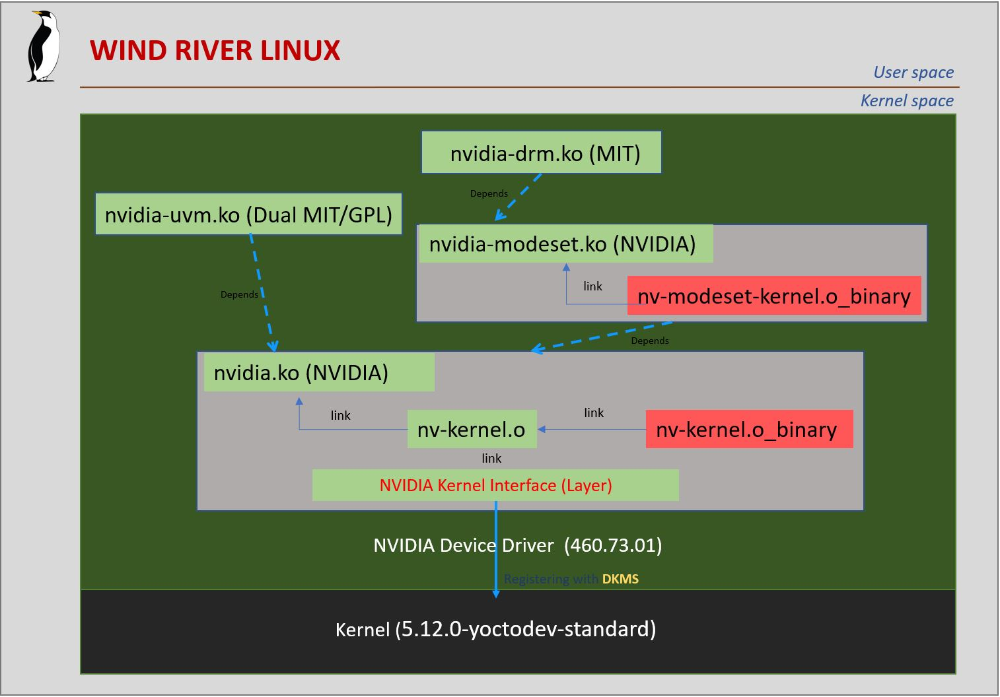

# GPU-WRLinux
Exploring NVIDIA GPU-Accelerated Ecosystem on Wind River Linux

## Overview


## Hardware


https://user-images.githubusercontent.com/1221587/123237713-7b508680-d510-11eb-8ff5-7571d9103697.mov

## Software
### Wind River Linux Kernel and NVIDIA Device Driver


### X Server and OpenGL


### NVIDIA Driver Userspace Component


## Setup Steps
* [Build and deploy WR Linux and NVIDIA Driver](https://github.com/charleshardy/GPU-WRLinux/blob/main/3_Software/2_Kernel_Device_Driver/README.md)
* [Start XFCE desktop and check NVIDIA GPU](https://github.com/charleshardy/GPU-WRLinux/blob/main/3_Software/3_X_Windows_Desktop/README.md)
* [CUDA installation and verification](https://github.com/charleshardy/GPU-WRLinux/blob/main/3_Software/4_Toolkit_SDK/CUDA/README.md)
* [CUDA-X Installation](https://github.com/charleshardy/GPU-WRLinux/blob/main/3_Software/4_Toolkit_SDK/CUDA-X/README.md)
* [Unreal Engine Installation](https://github.com/charleshardy/GPU-WRLinux/tree/main/3_Software/4_Toolkit_SDK/UnrealEngine#README.md)
* [Unity Installation](https://github.com/charleshardy/GPU-WRLinux/tree/main/3_Software/4_Toolkit_SDK/Unity#README.md)
* [TensorFlow Installation](https://github.com/charleshardy/GPU-WRLinux/tree/main/3_Software/4_Toolkit_SDK/TensorFlow#README.md)
* [PyTorch Installation](https://github.com/charleshardy/GPU-WRLinux/tree/main/3_Software/4_Toolkit_SDK/PyTorch#README.md)
* [MXNet Installation](https://github.com/charleshardy/GPU-WRLinux/tree/main/3_Software/4_Toolkit_SDK/MXNet#README.md)
* [Video Codec SDK Installation (TODO)](https://github.com/charleshardy/GPU-WRLinux/tree/main/3_Software/4_Toolkit_SDK/VideoCodecSDK#README.md)
* [Transfer Learning Toolkit Installation (TODO)](https://github.com/charleshardy/GPU-WRLinux/tree/main/3_Software/4_Toolkit_SDK/TransferLearningToolkit#README.md)
## Demo
### CUDA Examples
```
     Demo Video (TODO)
```
* [Details](https://github.com/charleshardy/GPU-WRLinux/tree/main/3_Software/5_Applications/CUDA#README.md)

### CUDA-X Example (NeMo)
```
     Demo Video (TODO)
```
* [Details](https://github.com/charleshardy/GPU-WRLinux/blob/main/3_Software/5_Applications/CUDA-X/NeMo/README.md)

### Unreal Engine Demo (First 3D Game)
```
     Demo Video (TODO)
```
* [Details](https://github.com/charleshardy/GPU-WRLinux/blob/main/3_Software/5_Applications/UnrealEngine/README.md)

### Unity Demo (Vehicle Physics)
```
     Demo Video (TODO)
```
* [Details](https://github.com/charleshardy/GPU-WRLinux/blob/main/3_Software/5_Applications/Unity/README.md)

### Tensorflow 

#### Calculate Regression (Tensorboard)
```
     Demo Video (TODO)
```
#### Image Object Recognition 
```
     Demo Video (TODO)
```

* [Details](https://github.com/charleshardy/GPU-WRLinux/blob/main/3_Software/5_Applications/tensorflow/README.md)

### PyTorch (Text Generation)
```
     Demo Video (TODO)
```
* [Details](https://github.com/charleshardy/GPU-WRLinux/blob/main/3_Software/5_Applications/PyTorch/README.md)

### MXNet (Image Superresolution)
```
     Demo Video (TODO)
```
* [Details](https://github.com/charleshardy/GPU-WRLinux/blob/main/3_Software/5_Applications/MXNet/README.md)

## FAQ
* [How about GPU performance comparisons between Wind River Linux and Ubuntu?](https://github.com/charleshardy/GPU-WRLinux/blob/main/4_QA/README.md)
* [How to verify the GPU works well on Wind River Linux?](https://github.com/charleshardy/GPU-WRLinux/blob/main/4_QA/README.md)
* [Can NVIDIA GPU run on any ARM based boards?](https://github.com/charleshardy/GPU-WRLinux/blob/main/4_QA/README.md)

