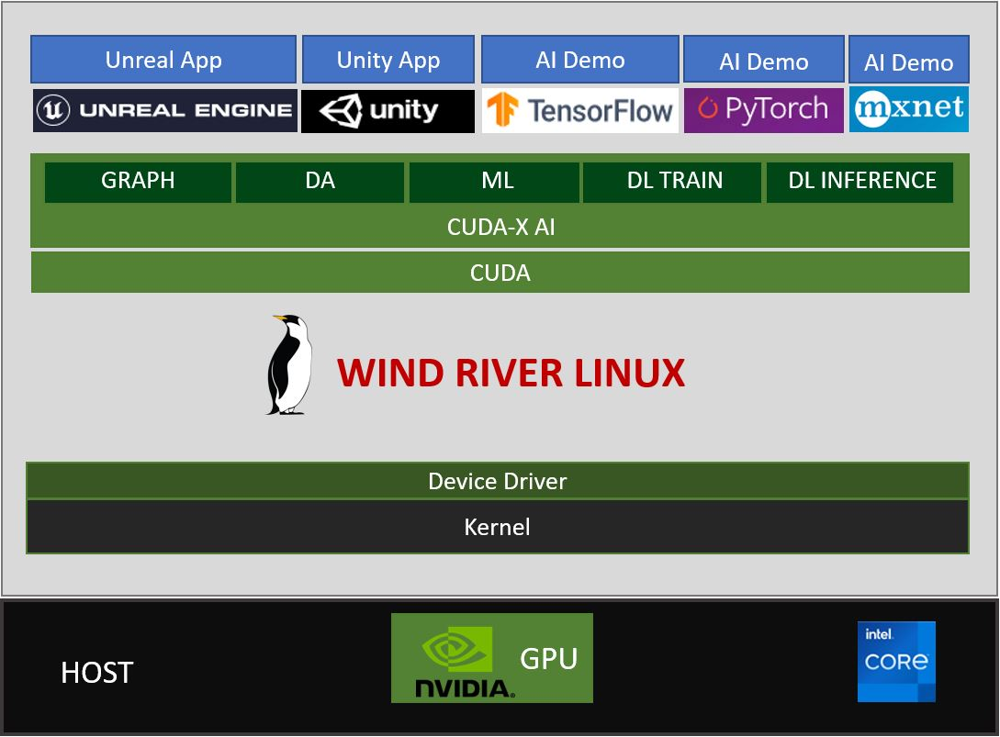

# GPU-WRLinux
Exploring NVIDIA GPU-Accelerated Ecosystem on Wind River Linux

## Overview

## Hardware

## Software
### Wind River Linux Kernel and NVIDIA Device Driver

### X Server and OpenGL

### NVIDIA Driver Userspace Component

## Setup Steps
* [How to build and deploy WR Linux and NVIDIA Driver?](https://github.com/charleshardy/GPU-WRLinux/blob/main/3_Software/2_Kernel_Device_Driver/README.md)
* [How to start XFCE desktop and verify NVIDIA GPU working well?](https://github.com/charleshardy/GPU-WRLinux/blob/main/3_Software/3_X_Windows_Desktop/README.md)
* [CUDA installation and verification](https://github.com/charleshardy/GPU-WRLinux/blob/main/3_Software/4_Toolkit_SDK/CUDA/README.md)
* [How to install CUDA-X?](https://github.com/charleshardy/GPU-WRLinux/blob/main/3_Software/4_Toolkit_SDK/CUDA-X/README.md)
* [Unreal Engine Installation](https://github.com/charleshardy/GPU-WRLinux/tree/main/3_Software/4_Toolkit_SDK/UnrealEngine#README.md)
* [Unity Installation](https://github.com/charleshardy/GPU-WRLinux/tree/main/3_Software/4_Toolkit_SDK/Unity#README.md)
* [Video Codec SDK Installation (TODO)](https://github.com/charleshardy/GPU-WRLinux/tree/main/3_Software/4_Toolkit_SDK/VideoCodecSDK#README.md)
* [TensorFlow Installation](https://github.com/charleshardy/GPU-WRLinux/tree/main/3_Software/4_Toolkit_SDK/TensorFlow#README.md)
* [PyTorch Installation](https://github.com/charleshardy/GPU-WRLinux/tree/main/3_Software/4_Toolkit_SDK/PyTorch#README.md)
* [MXNet Installation](https://github.com/charleshardy/GPU-WRLinux/tree/main/3_Software/4_Toolkit_SDK/MXNet#README.md)
* [Transfer Learning Toolkit Installation (TODO)](https://github.com/charleshardy/GPU-WRLinux/tree/main/3_Software/4_Toolkit_SDK/TransferLearningToolkit#README.md)
### Demo
#### CUDA examples
			Demo Video 1:
			Demo Source Codes:
			Setup Steps:
			Issues:
			Solution:
			References:
#### CUDA-X Example (NeMo)
			Demo Video:
			Demo Source Codes:
			Setup Steps:
			Issues:
			Solution:
			References:
#### Unreal Demo (Metahuman)
			Demo Video:
			Demo Source Codes:
			Setup Steps:
			Issues:
			Solution:
			References:
#### Unity App (TODO)
			Demo Video:
			Demo Source Codes:
			Setup Steps:
			Issues:
			Solution:
			References:
#### Tensorflow (TODO)
			Demo Video:
			Demo Source Codes:
			Setup Steps:
			Issues:
			Solution:
			References:
#### PyTorch
	Demo Video:
		None

	Demo Source Codes:
		https://github.com/pytorch/examples/tree/master/word_language_model

	Setup Steps:
		(pytorch-build) $ git clone https://github.com/pytorch/examples.git
		(pytorch-build) $ cd examples/word_language_model
		(pytorch-build) $ python main.py --cuda --emsize 650 --nhid 650 --dropout 0.5 --epochs 40 --tied # 40 epoches, 141 minutes
		(pytorch-build) $ python generate.py --cuda --words 100
		| Generated 0/100 words
		(pytorch-build) $ cat generated.txt
		to the present of stabilized fountains , because they did not do so by the time they did contribute to
		the personal structure . Additionally , the rate of the entire event was often survives at projects of homes .
		<eos> The work records different as of 2009 . The front music guides erected all the style of several "
		<unk> " and " <unk> " <unk> ( proper water ) . In 2007 , Pflueger created the " More
		coded balanced " at this point and recorded a primary event played in a US 2 , which was the

	Issues:
		None

	Solution:
		None

	References:
		None
#### MXNet
	Demo Video:
		None

	Demo Source Codes:
		https://github.com/apache/incubator-mxnet/tree/master/example/gluon/super_resolution

	Setup Steps:
		1. Getting Source
			$ git clone --recursive https://github.com/apache/incubator-mxnet.git mxnet
			$ cd mxnet/example/gluon/super_resolution
			## have an update
			$ cat 0001-Update-super_resolution.py.patch
			From f4305b7944ab61a5b9a18a8bd627578279d9442f Mon Sep 17 00:00:00 2001
			From: test <test@test.com>
			Date: Sun, 6 Jun 2021 11:35:39 +0000
			Subject: [PATCH] Update super_resolution.py
			
			---
			example/gluon/super_resolution/super_resolution.py | 2 +-
			1 file changed, 1 insertion(+), 1 deletion(-)
			
			diff --git a/example/gluon/super_resolution/super_resolution.py b/example/gluon/super_resolution/super_resolution.py
			index 52bfc2241..4a3e8d92a 100644
			--- a/example/gluon/super_resolution/super_resolution.py
			+++ b/example/gluon/super_resolution/super_resolution.py
			@@ -156,7 +156,7 @@ class SuperResolutionNet(gluon.HybridBlock):
					return x
			
			net = SuperResolutionNet(upscale_factor)
			-metric = mx.gluon.metric.MSE()
			+metric = mx.metric.MSE()
			
			def test(ctx):
				val_data.reset()
			--
			2.31.1
			
			$ git am 0001-Update-super_resolution.py.patch
		2. Training and Trying
			## Training
			$ time python super_resolution.py --epochs 200 --use-gpu
			Namespace(upscale_factor=3, batch_size=4, test_batch_size=100, epochs=200, lr=0.001, use_gpu=True, seed=123, resolve_img=None)
			Directory /mnt/sdb/xhou/HOME/.mxnet/datasets/BSDS500 already exists, skipping.
			To force download and extraction, delete the directory and re-run.
			[08:32:10] ../src/base.cc:80: cuDNN lib mismatch: linked-against version 8200 != compiled-against version 8100.  Set MXNET_CUDNN_LIB_CHECKING=0 to quiet this warning.
			[08:32:12] ../src/operator/nn/./cudnn/./cudnn_algoreg-inl.h:97: Running performance tests to find the best convolution algorithm, this can take a while... (set the environment variable MXNET_CUDNN_AUTOTUNE_DEFAULT to 0 to disable)
			training mse at epoch 0: mse=0.020209
			validation avg psnr: 20.432425
			......
			training mse at epoch 199: mse=0.004085
			validation avg psnr: 23.290054
			
			real    6m36.315s
			user    15m1.850s
			sys 0m16.327s
			## Trying
			$ python super_resolution.py --resolve_img test.jpeg
The original picture:

and the enhanced one:

	Issues:
		None

	Solution:
		None

	References:
		https://github.com/apache/incubator-mxnet/tree/master/example/gluon/super_resolution
## FAQ
* [How about GPU performance comparisons between Wind River Linux and Ubuntu?](https://github.com/charleshardy/GPU-WRLinux/blob/main/4_QA/README.md)
* [How to verify the GPU works well on Wind River Linux?](https://github.com/charleshardy/GPU-WRLinux/blob/main/4_QA/README.md)
* [Can NVIDIA GPU run on any ARM based boards?](https://github.com/charleshardy/GPU-WRLinux/blob/main/4_QA/README.md)

